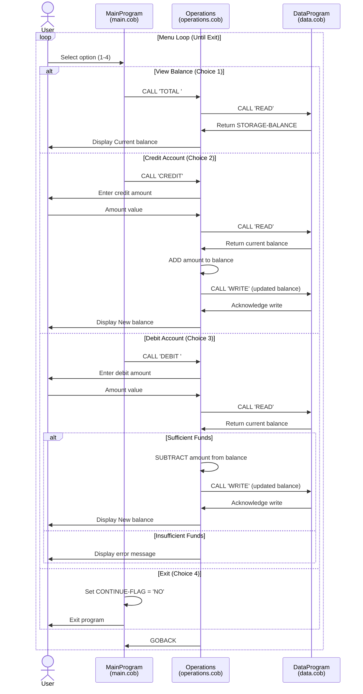

# COBOL Student Account System

This directory documents the COBOL sample program in `src/cobol` and explains the purpose of each source file, the key procedures, and the student account business rules.

## Files

### `src/cobol/main.cob`
- Main entry point for the console application.
- Presents a simple menu for account management:
  - `1. View Balance`
  - `2. Credit Account`
  - `3. Debit Account`
  - `4. Exit`
- Reads the user selection and calls `Operations` with one of the following command strings:
  - `TOTAL ` for balance inquiry
  - `CREDIT` for crediting an amount
  - `DEBIT ` for debiting an amount
- Handles invalid menu choices by displaying a prompt to select a valid option.
- Loops until the user chooses `Exit`.

### `src/cobol/operations.cob`
- Contains the account operation logic.
- Receives the operation type from `main.cob` and performs one of three actions:
  - `TOTAL `: retrieves the current balance and displays it.
  - `CREDIT`: prompts for a credit amount, reads the current balance, adds the amount, writes the updated balance, and displays the new balance.
  - `DEBIT `: prompts for a debit amount, reads the current balance, checks funds, and either subtracts the amount and updates the balance or reports insufficient funds.
- Uses `DataProgram` to persist or fetch the account balance.

### `src/cobol/data.cob`
- Implements simple balance storage and retrieval.
- Stores the account balance in `STORAGE-BALANCE`.
- Exposes two operations via `PROCEDURE DIVISION USING PASSED-OPERATION BALANCE`:
  - `READ`: moves the stored balance into the passed `BALANCE` field.
  - `WRITE`: updates the stored balance from the passed `BALANCE` field.
- Acts as a minimal persistence layer for account data within the program.

## Key Variables
- `STORAGE-BALANCE` (`PIC 9(6)V99`) in `data.cob`
  - Initial value: `1000.00`
  - Represents the student account opening balance.
- `FINAL-BALANCE` (`PIC 9(6)V99`) in `operations.cob`
  - Used as the working balance during operations.
- `AMOUNT` (`PIC 9(6)V99`) in `operations.cob`
  - Captures credit or debit amounts entered by the user.

## Business Rules for Student Accounts
- The account starts with an initial balance of `1000.00`.
- Credits are always accepted and immediately added to the current balance.
- Debits are only allowed when the account balance is greater than or equal to the requested amount.
- If a debit request exceeds the current balance, the program displays: `Insufficient funds for this debit.`
- Balance inquiries simply display the current account balance without changing it.
- Operation identifiers must match exactly the 6-character strings used by `main.cob` and `operations.cob`:
  - `TOTAL ` (with trailing spaces)
  - `CREDIT`
  - `DEBIT ` (with trailing spaces)

## Notes
- This sample code demonstrates a basic modular COBOL structure with:
  - a menu-driven main program,
  - a dedicated operations module,
  - and a simple data persistence module.
- The application does not use files for external persistence; balance state is kept in memory while the program runs.

## Data Flow Diagram

This diagram illustrates:
- **User Input Flow**: User selections trigger menu operations in MainProgram.
- **Operation Delegation**: MainProgram calls Operations with specific operation codes.
- **Data Access Pattern**: Operations uses DataProgram to read and write the account balance.
- **Decision Points**: The debit operation validates sufficient funds before allowing the transaction.
- **Loop Control**: The system loops back to the menu until the user exits.
